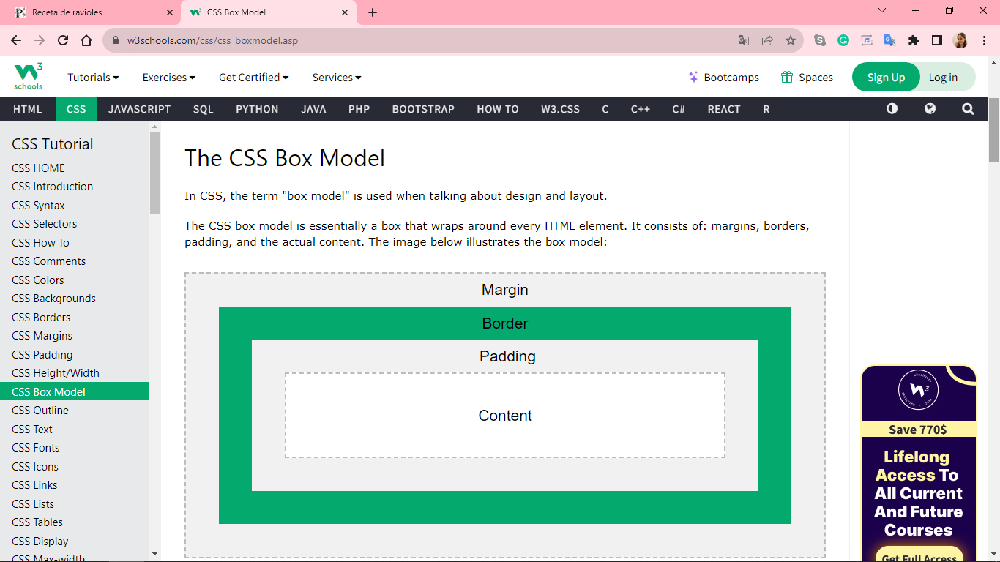

CLASE 7
BOX MODEL - Modelo de CAJA

Layout elements 
Etiquetas para ese agrupamiento: 

Permite agrupar elementos para darles su propio estilo dentro de su contenedor. (Crea una "caja") Sirve para darle un estilo con el css
Sirven para agrupar elementos de bloque, se comportan como elementos de bloque.

Modelo de cajas:

Link al sitio oficial w3school:
<a href= "https://www.w3schools.com/css/css_boxmodel.asp"  target= "_blank">

 
Permite agrupar elementos de linea(palabras, imagenes, enlaces por ej).

El Tamaño de la caja depende del contenido (tamaño de la letra, tamaño de la imágen)
Con las propiedades width(ancho) y height(alto) se pueden cambiar las propiedades de los elementos de bloque.
